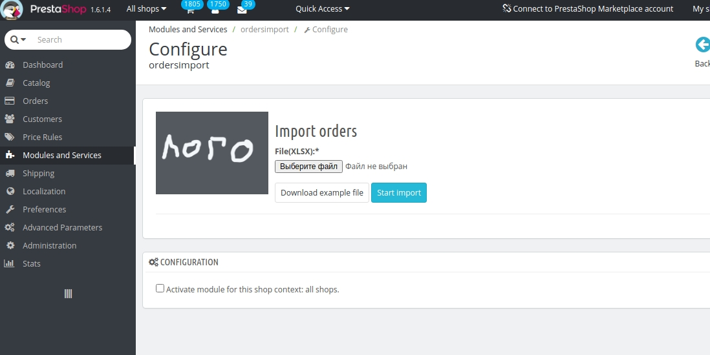
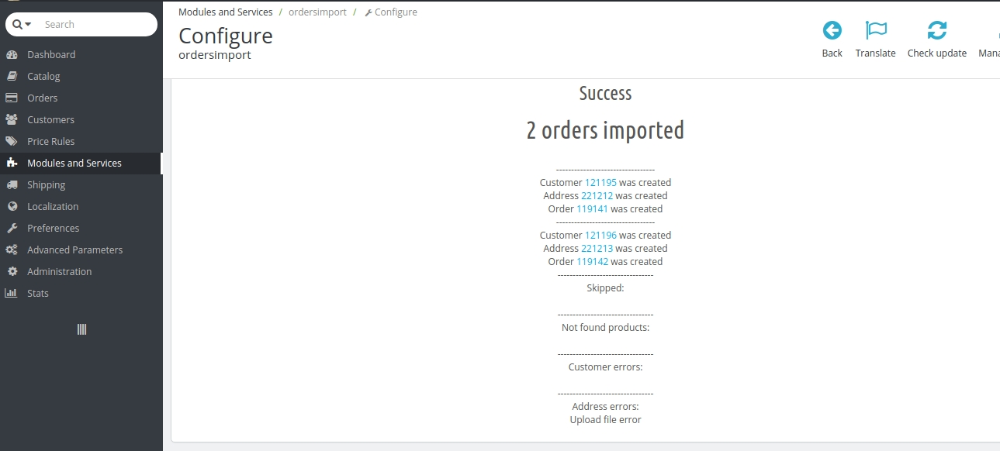

# Prestashop1.6-import-orders
Импорт заказов в prestashop 1.6

Импортирует заказы из excel файла. 1 строка = 1 заказ

Уже импортированные заказы игнорирует (по reference заказ)

Есть для простоты есть пример файла.

Страница модуля

Результат работы модуля

